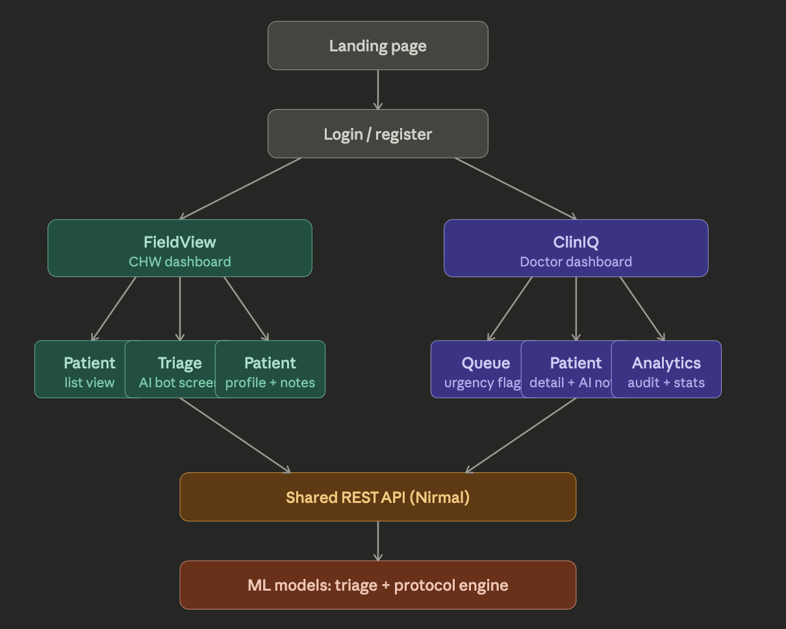

# CARA Scaffold



This repository is intentionally a **code-free scaffold**.  
All non-README files are empty placeholders; implementation will be written by the team.

## Team owners

- **Saksham Mishra**: frontend flow, repository structure, and integration coordination
- **Nirmal**: shared REST API, backend modules, and protocol-engine integration
- **Diya**: IMCI rule extraction and triage protocol authoring
- **Eman**: SOAP note formatting rules and keywords
- **Anaaya**: impact metrics, test cases, and demo narrative

## Free stack (locked choices)

| Layer | Tool | Why this pick |
| --- | --- | --- |
| Backend hosting | **Render** | Free tier, GitHub deploy, auto-restart, instant public URL |
| Database | **Supabase (PostgreSQL)** | Free Postgres + table UI + built-in auth |
| Frontend hosting | **Vercel** | GitHub auto-deploy, zero-config for React |
| ML API hosting | **Hugging Face Spaces** | Free FastAPI/Python hosting for model endpoint |
| Authentication | **Supabase Auth** | JWT auth already included with Supabase stack |
| API testing | **Thunder Client** | VS Code-native, no account needed |
| Environment variables | **Render env dashboard** | Simple UI-based env management |
| Version control | **GitHub** | Private repos + collaboration |
| Team tracking | **GitHub Projects** | Free Kanban in-repo |
| Design/wireframes | **Figma (free tier)** | Enough for prototype screens |

## Root files

| File | Job | How it will be filled | Owner |
| --- | --- | --- | --- |
| `.gitignore` | Ignore generated/local files | Add ignore rules for node, python cache, db, and env files | Saksham Mishra |
| `docker-compose.yml` | Local multi-service run config | Define frontend + backend services with shared env values | Nirmal |
| `architecture-flow.png` | Product architecture reference | Keep updated when app flow changes | Saksham Mishra |

## Folder responsibilities

| Folder | Job | How it will be filled | Owner |
| --- | --- | --- | --- |
| `frontend/` | UI shells and browser modules | Add HTML/CSS/JS implementation for FieldView and ClinIQ | Saksham Mishra |
| `backend/` | API, controllers, engine, and db setup | Add Express routes, controller logic, and persistence layer | Nirmal |
| `ml/` | Protocol rules, SOAP formatter inputs, impact data | Add validated protocol JSON and formatter logic | Diya, Eman, Anaaya |

## Datasets and sources for ML team

| Purpose | Source | Notes |
| --- | --- | --- |
| Triage/symptom classification | **MIMIC-III (PhysioNet)** | Student access; approval may take time. https://physionet.org/content/mimiciii |
| IMCI protocol rules | **WHO IMCI Chartbook PDF** | Convert decision tables into `protocol_rules.json` manually |
| Symptom-to-disease mapping | **Kaggle Disease Symptom Prediction** | Search Kaggle: `disease symptom prediction` |
| Maternal/pediatric cases | **OpenMRS demo dataset** | https://openmrs.org/download |
| Synthetic patient generation | **Synthea** | https://github.com/synthetichealth/synthea |

## ML scope (what to build now)

### Week 1-2 (prototype, no training)
- Convert WHO IMCI chartbook logic to rule JSON
- Use rule engine to return `Red / Yellow / Green` + reason
- Demo value comes from deterministic protocol behavior

### Week 3-4 (first model)
- Use Kaggle symptom CSV
- Train `RandomForestClassifier` fallback for unmatched rule cases

### Deferred (post-demo)
- Whisper integration
- LLM fine-tuning
- PyTorch-heavy pipelines

## Required ML API contract

```json
Input:  { "symptoms": ["fever", "cough"], "age_months": 14 }
Output: { "urgency": "Red", "reason": "Danger sign: difficulty breathing in child under 2" }
```

## Individual reading and task brief

### Diya
1. Read **WHO IMCI Chart Booklet (2014)** (Google: `WHO IMCI chart booklet PDF`)  
   Focus pages: **1-30** (Assess & Classify); danger signs, fever, cough, diarrhea tables.
2. Read **WHO IMAI District Clinician Manual**  
   Focus: Chapter 1 triage classification only.
3. Read WHO page on workforce shortage in LMICs  
   Search: `WHO health workforce shortage statistics 2024`.

### Eman
1. Learn SOAP note format  
   Search: `SOAP note medical format explained`.
2. JavaScript basics needed for formatter  
   Search: `JavaScript string includes() method` and `JavaScript string split() method`.
3. Skim symptom keywords from WHO IMCI PDF  
   Capture terms like fever, cough, breathing, vomiting for `keywords.json`.

### Anaaya
1. Use team docs first:
   - `Medical_Solution_to_Doctor_Shortage.md`
   - `Business_and_Ethics.md`
   - `CARA_Mitigation_Plan.md`
2. Verify/expand impact stats:
   - `WHO doctor to patient ratio Sub-Saharan Africa 2024`
   - `community health worker capacity LMIC WHO`
   - `patient follow-up adherence chronic disease Africa`
3. Review one demo-structure article:
   - `how to demo a hackathon project to judges`

## Execution plan

### Tonight / Day 1
- **Diya**: read WHO IMCI pages 1-30 and write first 3 rules in `imci.json`
- **Eman**: read SOAP explainer and fill `keywords.json`
- **Anaaya**: read team docs and fill `impact_data.json` from existing stats

### Day 2
- **Diya**: finalize `imci.json` and send to Nirmal
- **Eman**: write `soap_formatter.js` and send to Saksham
- **Anaaya**: write `10 test_cases.json` and start `DEMO_SCRIPT.md`

### Day 3
- **All three**: test live system with Anaaya's test cases  
  Ship check: **"Does CARA give RED for Amara? Yes? Ship."**
